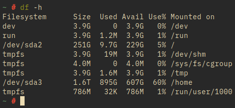
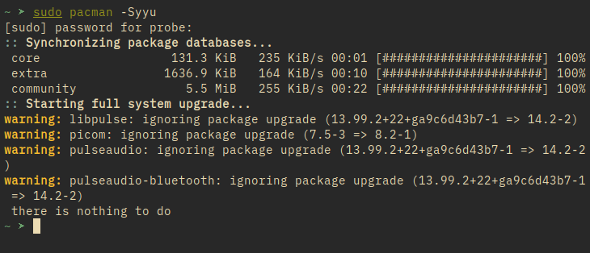

# zsh_custom

A basic zsh shell prompt with cozy looks and minimal plugins for fast and appealing shell experience

## Requirements

1. zsh (as default shell)
2. git

## Setup

To setup your zsh shell prompt in the same way, run these commands

```
git clone https://github.com/probe2k/zsh_custom.git /tmp/
mv /tmp/zsh_custom/.zshrc ~/.zshrc
```
If you wanna setup the two plugins I am using, add this set of code as well

```
mkdir ~/.zsh_plugin
git clone https://github.com/zsh-users/zsh-syntax-highlighting ~/.zsh_plugin/
git clone https://github.com/zsh-users/zsh-autosuggestions
```

## Images





## Disclaimer

You may need to setup ``` typeset -A key ``` differently as well as the ``` bindkey ``` profile depending on your keyboard's character encoding

# Issues

Feel free to PR with new add-ins / issue resolutions.
